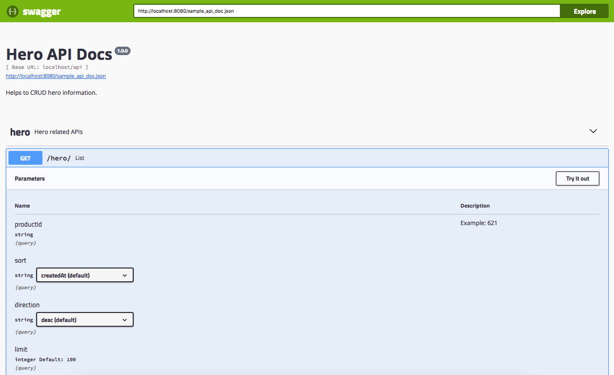

# joi-route-to-swagger

## Philosophy

Most programmers are not so willing to write documentations.  Also, the fact is that documentation is easily rotted as time goes by with changing requirement.  

[Wiki]: https://en.wikipedia.org/wiki/Self-documenting_code
[article]: https://www.martinfowler.com/bliki/CodeAsDocumentation.html

How to maintain documentation is a long-lasting problem in software engineering.  Hence, there raises a perspective that our written code should be self-documented.  What does it mean?  If you are not familiar with this concept, please take a visit on [Wiki][] and Martin Fowler's [article][].  

## Objective

This tool provides Node.js application an option to keep their API doc up to date.  

API doc serves a very important role for the communication between parties implementing the frontend and backend.  Besides better naming and reasonable url path, API query/body/param description and restriction are the most important parts.  They are also the part that is changed more often due to requirement change.  

How can we make the API docs self-documented and kept up to date?  If the API docs can be automatically updated once the code is changed, it would be fantastic.  

[joi]: https://github.com/hapijs/joi
[Swagger]: https://swagger.io/

In order to achieve this, we need a documentary approach to define our API with the support of the powerful tools [Swagger][] and [joi][].  Let's see how we achieve this in `Usage` section below.  

## Installation

>npm install joi-route-to-swagger --save-dev

## Usage

### Route Definition

A documentary approach to define route is like the sample code below.  Although this example is used in my Express.js project, it can also be applied to project using restify, hapi, etc.  

The main purpose is to use a descriptive JSON to describe what your routes look like, including its path, description, middlewares, validation criteria, sample response, etc.  

```javascript
const joi = require('joi');

function dummyMiddlewareA() { }
function dummyMiddlewareB() { }
function dummyMiddlewareC() { }

const moduleRouteDef = {
  basePath: '/hero',
  description: 'Hero related APIs',
  routes: [
    {
      method: 'get',
      path: '/',
      summary: 'List',
      description: '',
      action: dummyMiddlewareA,
      validators: {
        query: joi.object().keys({
          productId: joi.string().example('621'),
          sort: joi.string().valid('createdAt', 'updatedAt').default('createdAt'),
          direction: joi.string().valid('desc', 'asc').default('desc'),
          limit: joi.number().integer().max(100).default(100),
          page: joi.number().integer()
        }).with('sort', 'direction')
      },
      responseExamples: [
        {
          code: 200,
          data: {
            err: null,
            data: {
              records: [
                {
                  _id: '59ba1f3c2e9787247e29da9b',
                  updatedAt: '2017-09-14T06:18:36.786Z',
                  createdAt: '2017-09-14T06:18:36.786Z',
                  nickName: 'Ken',
                  avatar: '',
                  gender: 'Male'
                }
              ],
              totalCount: 1,
              page: 1
            }
          }
        }
      ]
    },
    {
      method: 'post',
      path: '/',
      summary: 'Create',
      description: '',
      action: [dummyMiddlewareB, dummyMiddlewareC],
      validators: {
        body: joi.object().keys({
          nickName: joi.string().required().example('鹄思乱想').description('Hero Nickname'),
          avatar: joi.string().required(),
          gender: joi.string().valid('Male', 'Female', ''),
          skills: joi.array().items(joi.string()).example(['teleport', 'invisible'])
        })
      }
    }
  ]
};

module.exports = moduleRouteDef;
```

### Converting Route Definition to Swagger Docs

Once you have defined your API routes as above, you can use this tool to convert it to Swagger docs in JSON format.

```javascript
const convert = require('joi-route-to-swagger').convert;
const sampleRoutes = require('./test/fixtures/mockA-routes');

const swaggerDocs = convert([sampleRoutes]);
```

## Test & Generate Sample Swagger Docs

Executes below test command will:  

1. Converts all the routes definition file with `-routes.js` suffix in `test/fixtures/` folder to a Swagger docs JSON.  
2. Validate the converted JSON against Swagger Schema 2.0.  
3. Generate the Swagger docs JSON to a file in `test/sample_api_doc.json`.  

>npm run test

## View Generated API Document

Executes below command will startup a static server to host the sample Swagger docs locally:  

http://localhost:8080/swagger-ui/index.html



[Swagger UI]: https://swagger.io/swagger-ui/

Of course, you can also download the [Swagger UI][] to host the API routes docs for yourself.  

_Notes: You may find that the UI is a bit different from what you see in https://editor.swagger.io/ .  I customized it to show enumeration and default value as well.  :)_  

Enjoy.  


## License

MIT
